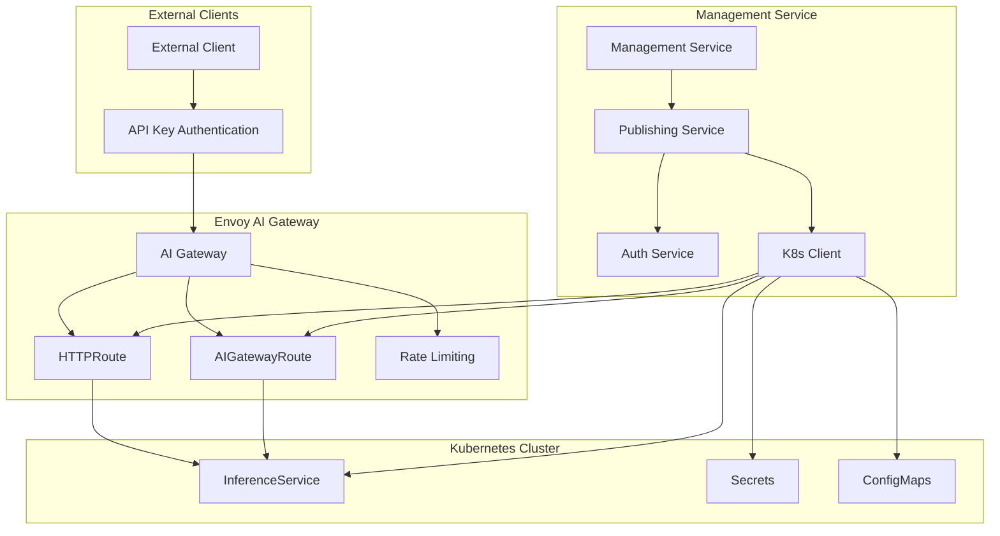
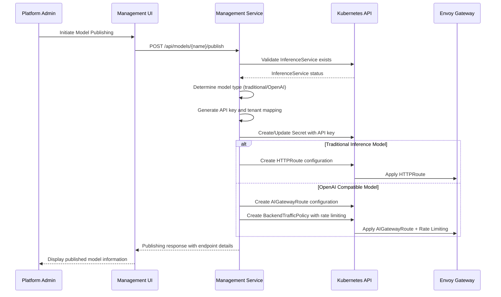

# Design Document

## Overview

The Model Publishing workflow extends the existing management service to automate the process of exposing deployed InferenceService models for external consumption. This feature bridges the gap between model deployment (creating KServe InferenceService resources) and external access by implementing tenant-based access control, API key generation, and appropriate gateway routing configurations.

The system will automatically determine whether to create HTTPRoute configurations for traditional inference services or AIGatewayRoute configurations for OpenAI-compatible models, including comprehensive rate limiting and token bucket configurations based on the KServe AI Gateway integration patterns.

## Architecture

### High-Level Architecture



### Publishing Workflow



## Components and Interfaces

### 1. Publishing Service (New)

**Location**: `management/publishing.go`

**Responsibilities**:
- Orchestrate model publishing workflow
- Generate and manage API keys
- Determine model type and appropriate gateway configuration
- Create gateway routes and rate limiting policies
- Manage published model lifecycle

**Key Methods**:
```go
type PublishingService struct {
    k8sClient    *K8sClient
    authService  *AuthService
    config       *Config
}

func (s *PublishingService) PublishModel(namespace, modelName string, config PublishConfig) (*PublishedModel, error)
func (s *PublishingService) UnpublishModel(namespace, modelName string) error
func (s *PublishingService) ListPublishedModels(namespace string) ([]PublishedModel, error)
func (s *PublishingService) UpdatePublishedModel(namespace, modelName string, config PublishConfig) (*PublishedModel, error)
func (s *PublishingService) RotateAPIKey(namespace, modelName string) (*PublishedModel, error)
```

### 2. Extended K8s Client

**Location**: `management/k8s.go` (extended)

**New Methods**:
```go
// Gateway API operations
func (k *K8sClient) CreateHTTPRoute(namespace string, route map[string]interface{}) error
func (k *K8sClient) UpdateHTTPRoute(namespace, name string, route map[string]interface{}) error
func (k *K8sClient) DeleteHTTPRoute(namespace, name string) error

// AI Gateway operations  
func (k *K8sClient) CreateAIGatewayRoute(namespace string, route map[string]interface{}) error
func (k *K8sClient) UpdateAIGatewayRoute(namespace, name string, route map[string]interface{}) error
func (k *K8sClient) DeleteAIGatewayRoute(namespace, name string) error

// Rate limiting policies
func (k *K8sClient) CreateBackendTrafficPolicy(namespace string, policy map[string]interface{}) error
func (k *K8sClient) UpdateBackendTrafficPolicy(namespace, name string, policy map[string]interface{}) error
func (k *K8sClient) DeleteBackendTrafficPolicy(namespace, name string) error

// Secret management for API keys
func (k *K8sClient) CreateAPIKeySecret(namespace, modelName, apiKey string) error
func (k *K8sClient) UpdateAPIKeySecret(namespace, modelName, apiKey string) error
func (k *K8sClient) DeleteAPIKeySecret(namespace, modelName string) error
```

### 3. Extended Management Server

**Location**: `management/server.go` (extended)

**New API Endpoints**:
```go
// Model publishing endpoints
protected.POST("/models/:modelName/publish", s.publishingService.PublishModel)
protected.DELETE("/models/:modelName/publish", s.publishingService.UnpublishModel)
protected.GET("/models/:modelName/publish", s.publishingService.GetPublishedModel)
protected.PUT("/models/:modelName/publish", s.publishingService.UpdatePublishedModel)
protected.POST("/models/:modelName/publish/rotate-key", s.publishingService.RotateAPIKey)

// Published models management
protected.GET("/published-models", s.publishingService.ListPublishedModels)
```

### 4. Extended UI Components

**New Components**:
- `PublishingForm.js` - Model publishing configuration form
- `PublishedModelsList.js` - List of published models with management actions
- `APIKeyManager.js` - API key rotation and management
- `PublishingDashboard.js` - Overview of published models and usage metrics

**Extended Components**:
- `ModelList.js` - Add "Publish" action button
- `Dashboard.js` - Add published models section

## Data Models

### 1. Published Model Configuration

```go
type PublishConfig struct {
    TenantID        string            `json:"tenantId" binding:"required"`
    ModelType       string            `json:"modelType"` // "traditional" or "openai"
    ExternalPath    string            `json:"externalPath"`
    RateLimiting    RateLimitConfig   `json:"rateLimiting"`
    Authentication  AuthConfig        `json:"authentication"`
    Metadata        map[string]string `json:"metadata"`
}

type RateLimitConfig struct {
    RequestsPerMinute int `json:"requestsPerMinute"`
    RequestsPerHour   int `json:"requestsPerHour"`
    TokensPerHour     int `json:"tokensPerHour"` // For OpenAI models
    BurstLimit        int `json:"burstLimit"`
}

type AuthConfig struct {
    RequireAPIKey bool     `json:"requireApiKey"`
    AllowedTenants []string `json:"allowedTenants"`
}
```

### 2. Published Model Response

```go
type PublishedModel struct {
    ModelName       string            `json:"modelName"`
    Namespace       string            `json:"namespace"`
    TenantID        string            `json:"tenantId"`
    ModelType       string            `json:"modelType"`
    ExternalURL     string            `json:"externalUrl"`
    APIKey          string            `json:"apiKey"`
    RateLimiting    RateLimitConfig   `json:"rateLimiting"`
    Status          string            `json:"status"`
    CreatedAt       time.Time         `json:"createdAt"`
    UpdatedAt       time.Time         `json:"updatedAt"`
    Usage           UsageStats        `json:"usage"`
    Documentation   APIDocumentation  `json:"documentation"`
}

type UsageStats struct {
    TotalRequests   int64 `json:"totalRequests"`
    RequestsToday   int64 `json:"requestsToday"`
    TokensUsed      int64 `json:"tokensUsed"` // For OpenAI models
    LastAccessTime  time.Time `json:"lastAccessTime"`
}

type APIDocumentation struct {
    EndpointURL     string            `json:"endpointUrl"`
    AuthHeaders     map[string]string `json:"authHeaders"`
    ExampleRequests []ExampleRequest  `json:"exampleRequests"`
    SDKExamples     map[string]string `json:"sdkExamples"` // Language -> code
}
```

## Error Handling

### 1. Publishing Validation Errors

```go
type PublishingError struct {
    Code    string `json:"code"`
    Message string `json:"message"`
    Details string `json:"details,omitempty"`
}

// Error codes
const (
    ErrModelNotFound        = "MODEL_NOT_FOUND"
    ErrModelNotReady        = "MODEL_NOT_READY"
    ErrInvalidTenant        = "INVALID_TENANT"
    ErrAlreadyPublished     = "ALREADY_PUBLISHED"
    ErrGatewayConfigFailed  = "GATEWAY_CONFIG_FAILED"
    ErrRateLimitConfigFailed = "RATE_LIMIT_CONFIG_FAILED"
    ErrAPIKeyGenerationFailed = "API_KEY_GENERATION_FAILED"
)
```

### 2. Gateway Configuration Validation

- Validate InferenceService exists and is ready
- Check tenant permissions and quotas
- Verify gateway resources are available
- Validate rate limiting configuration
- Ensure no conflicting routes exist

### 3. Rollback Mechanisms

- Automatic cleanup of partially created resources on failure
- Rollback gateway configurations if publishing fails
- Preserve existing configurations during updates
- Graceful handling of concurrent publishing operations

## Testing Strategy

### 1. Unit Tests

**Publishing Service Tests**:
- Model type detection logic
- API key generation and validation
- Gateway configuration generation
- Rate limiting policy creation
- Error handling and rollback scenarios

**K8s Client Tests**:
- Gateway resource CRUD operations
- Secret management operations
- Resource validation and error handling
- Mock Kubernetes API responses

### 2. Integration Tests

**End-to-End Publishing Workflow**:
- Complete model publishing flow from UI to gateway
- API key authentication and authorization
- Rate limiting enforcement
- Multi-tenant isolation verification
- Gateway route resolution and traffic routing

**Gateway Configuration Tests**:
- HTTPRoute creation and validation
- AIGatewayRoute creation with OpenAI schema
- BackendTrafficPolicy application
- Rate limiting policy enforcement

### 3. API Tests

**Publishing API Endpoints**:
- Model publishing with various configurations
- Published model management operations
- API key rotation and lifecycle management
- Error scenarios and validation

**Authentication and Authorization**:
- API key-based authentication
- Tenant-based access control
- Admin vs user permission validation

### 4. UI Tests

**Publishing Workflow UI**:
- Model publishing form validation
- Published models list and management
- API key display and rotation
- Error handling and user feedback

## Implementation Phases

### Phase 1: Core Publishing Infrastructure
- Implement PublishingService with basic functionality
- Extend K8sClient with gateway operations
- Add API endpoints for model publishing
- Create basic UI components for publishing

### Phase 2: Gateway Configuration
- Implement HTTPRoute generation for traditional models
- Implement AIGatewayRoute generation for OpenAI models
- Add rate limiting policy creation
- Integrate with existing gateway infrastructure

### Phase 3: API Key Management
- Implement API key generation and storage
- Add key rotation functionality
- Create authentication middleware for published models
- Add usage tracking and monitoring

### Phase 4: Advanced Features
- Add comprehensive rate limiting configurations
- Implement usage analytics and reporting
- Add API documentation generation
- Create SDK examples and client libraries

### Phase 5: Monitoring and Observability
- Integrate with existing Prometheus metrics
- Add Grafana dashboards for published models
- Implement alerting for rate limit violations
- Add audit logging for publishing operations

## Security Considerations

### 1. API Key Security
- Generate cryptographically secure API keys
- Store keys encrypted in Kubernetes secrets
- Implement key rotation without service interruption
- Audit all key generation and rotation events

### 2. Tenant Isolation
- Enforce strict tenant boundaries in gateway configurations
- Validate tenant permissions before publishing
- Prevent cross-tenant access to published models
- Implement resource quotas per tenant

### 3. Rate Limiting Security
- Prevent rate limit bypass attempts
- Implement distributed rate limiting for high availability
- Add circuit breaker patterns for backend protection
- Monitor and alert on suspicious traffic patterns

### 4. Gateway Security
- Validate all gateway configurations before application
- Implement least-privilege access for gateway resources
- Secure communication between gateway and backend services
- Regular security audits of gateway configurations

## Performance Considerations

### 1. Gateway Performance
- Optimize route matching and resolution
- Implement efficient rate limiting algorithms
- Use connection pooling and keep-alive
- Monitor gateway latency and throughput

### 2. API Key Lookup Performance
- Implement efficient API key validation
- Use caching for frequently accessed keys
- Optimize secret retrieval from Kubernetes
- Consider external key management systems for scale

### 3. Rate Limiting Performance
- Use efficient rate limiting algorithms (token bucket, sliding window)
- Implement distributed rate limiting for multi-replica deployments
- Optimize rate limit counter storage and retrieval
- Monitor rate limiting overhead and impact

### 4. Monitoring and Metrics
- Implement efficient metrics collection
- Use sampling for high-volume metrics
- Optimize dashboard queries and aggregations
- Consider metrics retention and storage costs