# 🚀 Inference-in-a-Box: Enterprise AI/ML Platform Demo

A complete, production-ready inference platform that demonstrates enterprise-grade AI/ML model serving using modern cloud-native technologies. This platform combines **Envoy AI Gateway**, **Istio service mesh**, **KServe serverless model serving**, and **comprehensive observability** to create a robust, scalable, and secure inference-as-a-service solution.

## 🎯 What You're Building

**Inference-in-a-Box** is a comprehensive demonstration of how modern organizations can deploy AI/ML models at enterprise scale with:

- **🔒 Zero-Trust Security** - Automatic mTLS encryption, fine-grained authorization, and compliance-ready audit logging
- **⚡ Serverless Inference** - Auto-scaling from zero to N instances based on traffic demand
- **🌐 Multi-Tenant Architecture** - Secure isolation between different teams, projects, and customers
- **📊 Enterprise Observability** - Full-stack monitoring, distributed tracing, and AI-specific metrics
- **🚪 Unified AI Gateway** - Envoy AI Gateway as the primary entry point with JWT authentication and intelligent routing
- **🎛️ Traffic Management** - Canary deployments, A/B testing, and intelligent routing

## 🏗️ Platform Architecture


## 🛠️ Technology Stack

### Core Platform Components
- **🐳 Kind** - Local Kubernetes cluster for development and testing
- **🚪 Envoy Gateway** - Cloud-native API gateway with advanced routing capabilities
- **🤖 Envoy AI Gateway** - AI-specific gateway with JWT authentication and model routing
- **🕸️ Istio** - Service mesh for security, traffic management, and observability
- **🦾 KServe** - Kubernetes-native model serving with auto-scaling
- **🌊 Knative** - Serverless framework for event-driven applications
- **🔐 Cert Manager** - Automated certificate management

### Observability & Monitoring
- **📈 Prometheus** - Metrics collection and alerting
- **📊 Grafana** - Visualization and dashboards
- **🔍 Jaeger** - Distributed tracing
- **🗺️ Kiali** - Service mesh visualization
- **🚨 AlertManager** - Alert routing and management

### AI/ML Support
- **🧠 TensorFlow Serving** - TensorFlow model serving
- **🔥 PyTorch Serve** - PyTorch model serving  
- **⚡ Scikit-learn** - Traditional ML model serving
- **🤗 Hugging Face** - Transformer model support

## 🎯 Key Features Demonstrated

### 🔒 Enterprise Security


- **Zero-trust networking** with automatic mTLS between all services
- **Multi-tenant isolation** with namespace-based security boundaries
- **RBAC and authentication** with JWT/API key validation
- **Audit logging** for compliance requirements (GDPR, HIPAA, SOC 2)
- **Certificate management** with automatic rotation

### ⚡ AI/ML Model Serving


- **Serverless auto-scaling** from zero to N instances based on demand
- **Multi-framework support** (Scikit-learn, PyTorch, TensorFlow, Hugging Face)
- **AI Gateway routing** with intelligent path-based and header-based routing
- **Canary deployments** for gradual model rollouts
- **A/B testing** with intelligent traffic splitting
- **Model versioning** and rollback capabilities
- **Resource optimization** with GPU/CPU scheduling

### 🌐 Multi-Tenancy & Governance
- **Workspace isolation** with dedicated namespaces per tenant
- **Resource quotas** and governance policies
- **Separate observability** scopes for each tenant
- **Independent lifecycle** management and deployment schedules
- **Cost tracking** and chargeback mechanisms

### 📊 Comprehensive Observability


- **End-to-end distributed tracing** across the entire inference pipeline
- **AI-specific metrics** including inference latency, throughput, and accuracy
- **Business metrics** for cost optimization and resource planning
- **SLA monitoring** with automated alerting
- **Unified dashboards** for operational visibility

## 🖥️ Management Service

The **Management Service** is a comprehensive web-based platform for managing AI/ML model inference operations. It provides both a REST API and an intuitive React-based web interface for complete model lifecycle management.

### 🎯 Key Features

#### **Model Publishing & Management**
- **One-click model publishing** with configurable external access
- **Public hostname configuration** (default: `api.router.inference-in-a-box`)
- **Update published models** - modify rate limits, paths, and hostnames
- **Multi-tenant model isolation** with namespace-based security
- **Automatic model type detection** (Traditional vs OpenAI-compatible)

#### **Rate Limiting & Traffic Control**
- **Per-model rate limiting** with configurable requests per minute/hour
- **Token-based rate limiting** for OpenAI-compatible models
- **Burst limit configuration** for handling traffic spikes
- **Dynamic rate limit updates** without republishing models

#### **External Access & Routing**
- **Configurable public hostnames** for external model access
- **Custom path routing** for model endpoints
- **Automatic gateway configuration** (Envoy AI Gateway + Istio)
- **SSL/TLS termination** with automatic certificate management

#### **Security & Authentication**
- **JWT-based authentication** with tenant isolation
- **API key management** for external access
- **API key rotation** with zero-downtime updates
- **Admin and tenant-level permissions**

### 🔧 Technical Architecture


### 📋 API Endpoints

#### **Model Management**
- `GET /api/models` - List all models
- `POST /api/models` - Create new model
- `GET /api/models/{name}` - Get model details
- `PUT /api/models/{name}` - Update model configuration
- `DELETE /api/models/{name}` - Delete model

#### **Model Publishing**
- `POST /api/models/{name}/publish` - Publish model for external access
- `PUT /api/models/{name}/publish` - Update published model configuration
- `GET /api/models/{name}/publish` - Get published model details
- `DELETE /api/models/{name}/publish` - Unpublish model
- `GET /api/published-models` - List all published models

#### **API Key Management**
- `POST /api/models/{name}/publish/rotate-key` - Rotate API key
- `POST /api/validate-api-key` - Validate API key (for gateway)

#### **Admin Operations**
- `GET /api/admin/system` - System information
- `GET /api/admin/tenants` - Tenant management
- `POST /api/admin/kubectl` - Execute kubectl commands

### 🌐 Web Interface Access

```bash
# Access the Management Service UI
kubectl port-forward svc/management-service 8085:80

# Open in browser
open http://localhost:8085
```

### 🔗 Publishing Workflow Example

#### Admin Authentication & Setup

```bash
# Admin login and get JWT token
export ADMIN_TOKEN=$(curl -s -X POST -H "Content-Type: application/json" \
  -d '{"username": "admin", "password": "password"}' \
  http://localhost:8085/api/admin/login | jq -r '.token')

# Verify login
curl -H "Authorization: Bearer $ADMIN_TOKEN" \
  http://localhost:8085/api/admin/system
```

#### Model Publishing Workflow

```bash
# 1. Create a model
curl -X POST -H "Authorization: Bearer $ADMIN_TOKEN" \
  -H "Content-Type: application/json" \
  -d '{"name": "my-model", "framework": "sklearn", "storageUri": "s3://my-bucket/model"}' \
  http://localhost:8085/api/models

# 2. Publish model with custom hostname
curl -X POST -H "Authorization: Bearer $ADMIN_TOKEN" \
  -H "Content-Type: application/json" \
  -d '{
    "config": {
      "tenantId": "tenant-a",
      "publicHostname": "api.router.inference-in-a-box",
      "externalPath": "/models/my-model",
      "rateLimiting": {
        "requestsPerMinute": 100,
        "requestsPerHour": 5000
      }
    }
  }' \
  http://localhost:8085/api/models/my-model/publish

# 3. Update published model configuration
curl -X PUT -H "Authorization: Bearer $ADMIN_TOKEN" \
  -H "Content-Type: application/json" \
  -d '{
    "config": {
      "tenantId": "tenant-a",
      "publicHostname": "api.router.inference-in-a-box",
      "rateLimiting": {
        "requestsPerMinute": 200,
        "requestsPerHour": 10000
      }
    }
  }' \
  http://localhost:8085/api/models/my-model/publish

# 4. Access published model externally
curl -H "X-API-Key: $API_KEY" \
  https://api.router.inference-in-a-box/models/my-model/predict \
  -d '{"input": "sample data"}'
```

#### Complete Admin API Demo

For a comprehensive example of all admin API operations, use the provided script:

```bash
# Run the complete admin API demo
./scripts/admin-api-example.sh
```

This script demonstrates:
- Admin authentication
- System information retrieval
- Model and tenant management
- Model publishing workflow
- External API testing
- kubectl command execution

## 🚀 Quick Start

### Prerequisites
Ensure you have the following tools installed:
```bash
# Required tools
docker --version          # Docker 20.10+
kind --version           # Kind 0.20+
kubectl version --client  # kubectl 1.24+
helm version             # Helm 3.12+
curl --version           # curl (any recent version)
jq --version             # jq 1.6+
```

### One-Command Bootstrap
```bash
# Clone the repository
git clone <repository-url>
cd inference-in-a-box

# Bootstrap the entire platform (takes 10-15 minutes)
./scripts/bootstrap.sh

# Run demo scenarios
./scripts/demo.sh

# Access the platform
echo "🎉 Platform is ready!"
echo "🤖 AI Gateway (Primary Entry): http://localhost:8080"
echo "📊 Grafana: http://localhost:3000 (admin/prom-operator)"
echo "📈 Prometheus: http://localhost:9090"
echo "🗺️ Kiali: http://localhost:20001"
echo ""
echo "💡 All AI/ML requests go through the AI Gateway first!"
echo "   The AI Gateway handles JWT auth and routes to Istio Gateway"
```

### Step-by-Step Setup
```bash
# 1. Create Kind cluster
./scripts/clusters/create-kind-cluster.sh

# 2. Install core infrastructure
./scripts/install/install-envoy-gateway.sh
./scripts/install/install-istio.sh
./scripts/install/install-kserve.sh
./scripts/install/install-observability.sh

# 3. Deploy sample models
./scripts/models/deploy-samples.sh

# 4. Configure security and policies
./scripts/security/setup-policies.sh

# 5. Run tests
./scripts/test/run-tests.sh
```

## Features Demonstrated

### 🔒 Enterprise Security
- Zero-trust networking with automatic mTLS
- Multi-tenant isolation with workspace boundaries
- RBAC and authentication policies
- Certificate management and rotation

### 🎯 AI/ML Model Serving
- Multiple ML frameworks (TensorFlow, PyTorch, Scikit-learn)
- Auto-scaling from zero to N instances
- Canary deployments and A/B testing
- Model versioning and rollback

### 🌐 Traffic Management
- Intelligent routing and load balancing
- Circuit breaking and failover
- Rate limiting and throttling
- Geographic routing simulation

### 📊 Observability
- Distributed tracing across the inference pipeline
- Custom metrics for AI workloads
- Unified logging and monitoring
- SLA tracking and alerting

### 🏢 Multi-Tenancy
- Namespace-based tenant isolation
- Resource quotas and governance
- Separate observability scopes
- Independent lifecycle management

## Directory Structure

```
inference-in-a-box/
├── README.md
├── scripts/
│   ├── bootstrap.sh
│   ├── cleanup.sh
│   ├── demo.sh
│   └── clusters/
│       ├── create-kind-cluster.sh
│       └── setup-networking.sh
├── configs/
│   ├── clusters/
│   │   └── cluster.yaml
│   ├── envoy-gateway/
│   │   ├── gatewayclass.yaml
│   │   ├── ai-gateway.yaml
│   │   ├── httproute.yaml
│   │   ├── ai-backends.yaml
│   │   ├── security-policies.yaml
│   │   └── rate-limiting.yaml
│   ├── istio/
│   │   ├── installation.yaml
│   │   ├── gateway.yaml
│   │   └── virtual-services/
│   ├── kserve/
│   │   ├── installation.yaml
│   │   └── models/
│   ├── envoy-ai-gateway/
│   │   └── configuration.yaml
│   └── observability/
│       ├── prometheus.yaml
│       └── grafana/
├── models/
│   ├── sklearn-iris/
│   ├── tensorflow-mnist/
│   └── pytorch-resnet/
├── examples/
│   ├── inference-requests/
│   ├── security-policies/
│   └── traffic-scenarios/
└── docs/
    ├── architecture.md
    ├── deployment-guide.md
    └── troubleshooting.md
```

## Prerequisites

- Docker Desktop or equivalent
- kubectl
- kind
- helm
- curl
- jq

## 🎭 Demo Scenarios

### 1. 🔒 Security & Authentication Demo


### 2. ⚡ Auto-scaling Demo
```bash
# The demo script automatically generates load through the AI Gateway
./scripts/demo.sh
# Select option 2 for auto-scaling demo

# Watch pods scale from 0 to N
watch "kubectl get pods -n tenant-a -l serving.kserve.io/inferenceservice=sklearn-iris"
```

### 3. 🚦 Canary Deployment Demo
```bash
# The demo script creates a canary deployment for sklearn-iris
./scripts/demo.sh
# Select option 3 for canary deployment demo

# Monitor traffic split
kubectl get virtualservice -n tenant-a
```

### 4. 🌐 Multi-Tenant Isolation Demo
```bash
# The demo script shows tenant isolation and resource boundaries
./scripts/demo.sh
# Select option 4 for multi-tenant isolation demo

# Verify isolation
kubectl get networkpolicies -A
```

## 📊 Monitoring & Observability

### Real-time Dashboards

```mermaid
graph LR
    subgraph "Grafana Dashboards"
        OVERVIEW["📊 Platform Overview"]
        MODELS["🤖 Model Performance"]
        SECURITY["🔒 Security Metrics"]
        BUSINESS["💰 Business KPIs"]
    end
    
    subgraph "Data Sources"
        PROM["📈 Prometheus"]
        JAEGER["🔍 Jaeger"]
        ISTIO["🕸️ Istio Metrics"]
        KSERVE["🤖 KServe Metrics"]
    end
    
    PROM --> OVERVIEW
    PROM --> MODELS
    ISTIO --> SECURITY
    KSERVE --> BUSINESS
    JAEGER --> MODELS
```


### Key Metrics Tracked
- **🎯 Model Performance**: Inference latency, throughput, accuracy
- **⚡ Infrastructure**: CPU/Memory usage, auto-scaling events
- **🔒 Security**: Authentication failures, policy violations
- **💰 Business**: Cost per inference, tenant usage, SLA compliance
- **🌐 Network**: Request rates, error rates, circuit breaker events

### Alert Configuration
```yaml
# Example alert rules
groups:
- name: inference.rules
  rules:
  - alert: HighInferenceLatency
    expr: histogram_quantile(0.95, rate(kserve_request_duration_seconds_bucket[5m])) > 1
    for: 2m
    labels:
      severity: warning
    annotations:
      summary: "High inference latency detected"
      
  - alert: ModelDown
    expr: up{job="kserve-model"} == 0
    for: 1m
    labels:
      severity: critical
    annotations:
      summary: "Model service is down"
```

## 🌐 Traffic Flow Architecture

### Tier-1/Tier-2 Gateway Design
The platform implements a **two-tier gateway architecture** where external traffic first hits the **Envoy AI Gateway** (Tier-1) and then flows to the **Istio Gateway** (Tier-2) for service mesh routing:

```mermaid
sequenceDiagram
    participant Client as 🖥️ Client Apps
    participant EAG as 🤖 AI Gateway (Tier-1)
    participant Auth as 🔐 JWT Auth
    participant IG as 🕸️ Istio Gateway (Tier-2)
    participant Model as 🎯 Model Service
    
    Client->>EAG: HTTP/REST Request
    EAG->>Auth: Validate JWT Token
    Auth-->>EAG: Token Valid (tenant-x)
    EAG->>EAG: Apply Rate Limits
    EAG->>EAG: Extract Model Name
    EAG->>IG: Route to Service Mesh
    IG->>Model: mTLS Encrypted Request
    Model-->>IG: Inference Response
    IG-->>EAG: Response via Service Mesh
    EAG-->>Client: Final Response
```



### Primary Access Patterns
1. **🎯 AI Model Inference**: `Client → AI Gateway → JWT Auth → Rate Limiting → Istio Gateway → Model Service`
2. **📊 Observability**: `Client → AI Gateway → Istio Gateway → Monitoring Services`
3. **🔧 Management**: `Client → AI Gateway → Istio Gateway → Admin Services`

### Gateway Responsibilities

#### 🚀 Tier-1: Envoy AI Gateway (Primary Entry Point)
- **Authentication**: JWT token validation with JWKS
- **Authorization**: Tenant-based access control
- **Rate Limiting**: Per-tenant and global limits
- **AI Protocol**: OpenAI-compatible API transformation
- **Routing**: Model-aware intelligent routing

#### 🕸️ Tier-2: Istio Gateway (Service Mesh)
- **mTLS**: Service-to-service encryption
- **Load Balancing**: Traffic distribution
- **Circuit Breaking**: Fault tolerance
- **Observability**: Metrics and tracing
- **Service Discovery**: Dynamic routing

## 🚪 AI Gateway Features

### JWT Authentication & Authorization
- **Tenant-specific JWT validation** with dedicated JWKS endpoints
- **Automatic claim extraction** to request headers for downstream services
- **Multi-provider support** for different authentication sources

### Intelligent Routing
- **Model-aware routing** based on x-ai-eg-model header
- **Header-based tenant routing** for multi-tenant isolation
- **Fallback routing** to Istio Gateway for non-AI traffic

### Rate Limiting & Traffic Management
- **Per-tenant rate limiting** with configurable limits
- **Global rate limiting** for platform protection
- **Circuit breaker** patterns for resilience
- **Retry policies** with exponential backoff

### Security & Compliance
- **CORS support** for web applications
- **TLS termination** at the edge
- **Security headers** injection
- **Audit logging** for compliance requirements

### Example API Usage
```bash
# All requests go through the AI Gateway first (Tier-1 Entry Point)
export AI_GATEWAY_URL="http://localhost:8080"
export JWT_TOKEN="<your-jwt-token>"

# Authenticated request to sklearn model (tenant-a)
curl -H "Authorization: Bearer $JWT_TOKEN" \
     -H "x-tenant: tenant-a" \
     -H "x-ai-eg-model: sklearn-iris" \
     $AI_GATEWAY_URL/v1/models/sklearn-iris:predict \
     -d '{"instances": [[5.1, 3.5, 1.4, 0.2]]}'

# Authenticated request to pytorch model (tenant-c)
curl -H "Authorization: Bearer $JWT_TOKEN" \
     -H "x-tenant: tenant-c" \
     -H "x-ai-eg-model: pytorch-resnet" \
     $AI_GATEWAY_URL/v1/models/pytorch-resnet:predict \
     -d '{"instances": [[[0.1, 0.2, 0.3]]]}'

# The AI Gateway handles:
# 1. JWT validation and tenant authorization
# 2. Rate limiting and traffic management  
# 3. Model routing based on headers
# 4. OpenAI protocol transformation
# 5. Forwarding to Istio Gateway (Tier-2)
```

## Getting Started

See [demo.md](demo.md) for comprehensive demo instructions and [CLAUDE.md](CLAUDE.md) for detailed deployment guidance.

## Troubleshooting

### Common Issues
- **Gateway not ready**: Check `kubectl get gateway -n envoy-gateway-system`
- **JWT validation fails**: Verify JWKS endpoint is accessible
- **Rate limiting**: Check rate limit policies and quotas
- **Model not accessible**: Verify model is ready and routable

### Verification Commands
```bash
# Check gateway status
kubectl get gatewayclass,gateway,httproute -n envoy-gateway-system

# Verify AI Gateway pods
kubectl get pods -n envoy-gateway-system

# Check model connectivity
kubectl get inferenceservice --all-namespaces
```