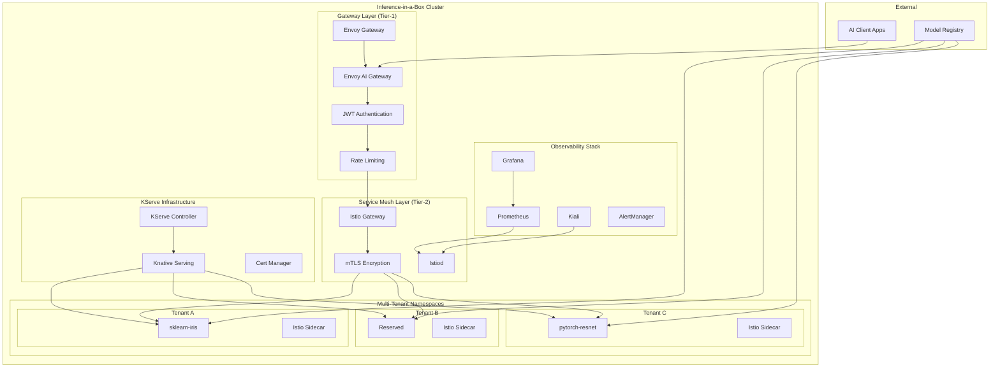

# 🚀 Inference-in-a-Box: Enterprise AI/ML Platform Demo

A complete, production-ready inference platform that demonstrates enterprise-grade AI/ML model serving using modern cloud-native technologies. This platform combines **Envoy AI Gateway**, **Istio service mesh**, **KServe serverless model serving**, and **comprehensive observability** to create a robust, scalable, and secure inference-as-a-service solution.

## 🎯 What You're Building

**Inference-in-a-Box** is a comprehensive demonstration of how modern organizations can deploy AI/ML models at enterprise scale with:

- **🔒 Zero-Trust Security** - Automatic mTLS encryption, fine-grained authorization, and compliance-ready audit logging
- **⚡ Serverless Inference** - Auto-scaling from zero to N instances based on traffic demand
- **🌐 Multi-Tenant Architecture** - Secure isolation between different teams, projects, and customers
- **📊 Enterprise Observability** - Full-stack monitoring, distributed tracing, and AI-specific metrics
- **🚪 Unified AI Gateway** - Envoy AI Gateway as the primary entry point with JWT authentication and intelligent routing
- **🎛️ Traffic Management** - Canary deployments, A/B testing, and intelligent routing

## 🏗️ Platform Architecture



## 🛠️ Technology Stack

### Core Platform Components
- **🐳 Kind** - Local Kubernetes cluster for development and testing
- **🚪 Envoy Gateway** - Cloud-native API gateway with advanced routing capabilities
- **🤖 Envoy AI Gateway** - AI-specific gateway with JWT authentication and model routing
- **🕸️ Istio** - Service mesh for security, traffic management, and observability
- **🦾 KServe** - Kubernetes-native model serving with auto-scaling
- **🌊 Knative** - Serverless framework for event-driven applications
- **🔐 Cert Manager** - Automated certificate management

### Observability & Monitoring
- **📈 Prometheus** - Metrics collection and alerting
- **📊 Grafana** - Visualization and dashboards
- **🔍 Jaeger** - Distributed tracing
- **🗺️ Kiali** - Service mesh visualization
- **🚨 AlertManager** - Alert routing and management

### AI/ML Support
- **🧠 TensorFlow Serving** - TensorFlow model serving
- **🔥 PyTorch Serve** - PyTorch model serving  
- **⚡ Scikit-learn** - Traditional ML model serving
- **🤗 Hugging Face** - Transformer model support

## 🎯 Key Features Demonstrated

### 🔒 Enterprise Security


- **Zero-trust networking** with automatic mTLS between all services
- **Multi-tenant isolation** with namespace-based security boundaries
- **RBAC and authentication** with JWT/API key validation
- **Audit logging** for compliance requirements (GDPR, HIPAA, SOC 2)
- **Certificate management** with automatic rotation

### ⚡ AI/ML Model Serving


- **Serverless auto-scaling** from zero to N instances based on demand
- **Multi-framework support** (Scikit-learn, PyTorch, TensorFlow, Hugging Face)
- **AI Gateway routing** with intelligent path-based and header-based routing
- **Canary deployments** for gradual model rollouts
- **A/B testing** with intelligent traffic splitting
- **Model versioning** and rollback capabilities
- **Resource optimization** with GPU/CPU scheduling

### 🌐 Multi-Tenancy & Governance
- **Workspace isolation** with dedicated namespaces per tenant
- **Resource quotas** and governance policies
- **Separate observability** scopes for each tenant
- **Independent lifecycle** management and deployment schedules
- **Cost tracking** and chargeback mechanisms

### 📊 Comprehensive Observability


- **End-to-end distributed tracing** across the entire inference pipeline
- **AI-specific metrics** including inference latency, throughput, and accuracy
- **Business metrics** for cost optimization and resource planning
- **SLA monitoring** with automated alerting
- **Unified dashboards** for operational visibility

## 🚀 Quick Start

### Prerequisites
Ensure you have the following tools installed:
```bash
# Required tools
docker --version          # Docker 20.10+
kind --version           # Kind 0.20+
kubectl version --client  # kubectl 1.24+
helm version             # Helm 3.12+
curl --version           # curl (any recent version)
jq --version             # jq 1.6+
```

### One-Command Bootstrap
```bash
# Clone the repository
git clone <repository-url>
cd inference-in-a-box

# Bootstrap the entire platform (takes 10-15 minutes)
./scripts/bootstrap.sh

# Run demo scenarios
./scripts/demo.sh

# Access the platform
echo "🎉 Platform is ready!"
echo "📊 Grafana: http://localhost:3000 (admin/prom-operator)"
echo "📈 Prometheus: http://localhost:9090"
echo "🗺️ Kiali: http://localhost:20001"
echo "🤖 AI Gateway: http://localhost:8080"
```

### Step-by-Step Setup
```bash
# 1. Create Kind cluster
./scripts/clusters/create-kind-cluster.sh

# 2. Install core infrastructure
./scripts/install/install-envoy-gateway.sh
./scripts/install/install-istio.sh
./scripts/install/install-kserve.sh
./scripts/install/install-observability.sh

# 3. Deploy sample models
./scripts/models/deploy-samples.sh

# 4. Configure security and policies
./scripts/security/setup-policies.sh

# 5. Run tests
./scripts/test/run-tests.sh
```

## Features Demonstrated

### 🔒 Enterprise Security
- Zero-trust networking with automatic mTLS
- Multi-tenant isolation with workspace boundaries
- RBAC and authentication policies
- Certificate management and rotation

### 🎯 AI/ML Model Serving
- Multiple ML frameworks (TensorFlow, PyTorch, Scikit-learn)
- Auto-scaling from zero to N instances
- Canary deployments and A/B testing
- Model versioning and rollback

### 🌐 Traffic Management
- Intelligent routing and load balancing
- Circuit breaking and failover
- Rate limiting and throttling
- Geographic routing simulation

### 📊 Observability
- Distributed tracing across the inference pipeline
- Custom metrics for AI workloads
- Unified logging and monitoring
- SLA tracking and alerting

### 🏢 Multi-Tenancy
- Namespace-based tenant isolation
- Resource quotas and governance
- Separate observability scopes
- Independent lifecycle management

## Directory Structure

```
inference-in-a-box/
├── README.md
├── scripts/
│   ├── bootstrap.sh
│   ├── cleanup.sh
│   ├── demo.sh
│   └── clusters/
│       ├── create-kind-cluster.sh
│       └── setup-networking.sh
├── configs/
│   ├── clusters/
│   │   └── cluster.yaml
│   ├── envoy-gateway/
│   │   ├── gatewayclass.yaml
│   │   ├── ai-gateway.yaml
│   │   ├── httproute.yaml
│   │   ├── ai-backends.yaml
│   │   ├── security-policies.yaml
│   │   └── rate-limiting.yaml
│   ├── istio/
│   │   ├── installation.yaml
│   │   ├── gateway.yaml
│   │   └── virtual-services/
│   ├── kserve/
│   │   ├── installation.yaml
│   │   └── models/
│   ├── envoy-ai-gateway/
│   │   └── configuration.yaml
│   └── observability/
│       ├── prometheus.yaml
│       └── grafana/
├── models/
│   ├── sklearn-iris/
│   ├── tensorflow-mnist/
│   └── pytorch-resnet/
├── examples/
│   ├── inference-requests/
│   ├── security-policies/
│   └── traffic-scenarios/
└── docs/
    ├── architecture.md
    ├── deployment-guide.md
    └── troubleshooting.md
```

## Prerequisites

- Docker Desktop or equivalent
- kubectl
- kind
- helm
- curl
- jq

## 🎭 Demo Scenarios

### 1. 🔒 Security & Authentication Demo


### 2. ⚡ Auto-scaling Demo
```bash
# The demo script automatically generates load through the AI Gateway
./scripts/demo.sh
# Select option 2 for auto-scaling demo

# Watch pods scale from 0 to N
watch "kubectl get pods -n tenant-a -l serving.kserve.io/inferenceservice=sklearn-iris"
```

### 3. 🚦 Canary Deployment Demo
```bash
# The demo script creates a canary deployment for sklearn-iris
./scripts/demo.sh
# Select option 3 for canary deployment demo

# Monitor traffic split
kubectl get virtualservice -n tenant-a
```

### 4. 🌐 Multi-Tenant Isolation Demo
```bash
# The demo script shows tenant isolation and resource boundaries
./scripts/demo.sh
# Select option 4 for multi-tenant isolation demo

# Verify isolation
kubectl get networkpolicies -A
```

## 📊 Monitoring & Observability

### Real-time Dashboards

```mermaid
graph LR
    subgraph "Grafana Dashboards"
        OVERVIEW["📊 Platform Overview"]
        MODELS["🤖 Model Performance"]
        SECURITY["🔒 Security Metrics"]
        BUSINESS["💰 Business KPIs"]
    end
    
    subgraph "Data Sources"
        PROM["📈 Prometheus"]
        JAEGER["🔍 Jaeger"]
        ISTIO["🕸️ Istio Metrics"]
        KSERVE["🤖 KServe Metrics"]
    end
    
    PROM --> OVERVIEW
    PROM --> MODELS
    ISTIO --> SECURITY
    KSERVE --> BUSINESS
    JAEGER --> MODELS
```


### Key Metrics Tracked
- **🎯 Model Performance**: Inference latency, throughput, accuracy
- **⚡ Infrastructure**: CPU/Memory usage, auto-scaling events
- **🔒 Security**: Authentication failures, policy violations
- **💰 Business**: Cost per inference, tenant usage, SLA compliance
- **🌐 Network**: Request rates, error rates, circuit breaker events

### Alert Configuration
```yaml
# Example alert rules
groups:
- name: inference.rules
  rules:
  - alert: HighInferenceLatency
    expr: histogram_quantile(0.95, rate(kserve_request_duration_seconds_bucket[5m])) > 1
    for: 2m
    labels:
      severity: warning
    annotations:
      summary: "High inference latency detected"
      
  - alert: ModelDown
    expr: up{job="kserve-model"} == 0
    for: 1m
    labels:
      severity: critical
    annotations:
      summary: "Model service is down"
```

## 🚪 AI Gateway Features

### JWT Authentication & Authorization
- **Tenant-specific JWT validation** with dedicated JWKS endpoints
- **Automatic claim extraction** to request headers for downstream services
- **Multi-provider support** for different authentication sources

### Intelligent Routing
- **Path-based routing** to different model services
- **Header-based tenant routing** for multi-tenant isolation
- **Fallback routing** to Istio Gateway for non-AI traffic

### Rate Limiting & Traffic Management
- **Per-tenant rate limiting** with configurable limits
- **Global rate limiting** for platform protection
- **Circuit breaker** patterns for resilience
- **Retry policies** with exponential backoff

### Security & Compliance
- **CORS support** for web applications
- **TLS termination** at the edge
- **Security headers** injection
- **Audit logging** for compliance requirements

### Example API Usage
```bash
# Authenticated request to sklearn model
curl -H "Authorization: Bearer <jwt-token>" \
     http://localhost:8080/v1/models/sklearn-iris:predict \
     -d '{"instances": [[5.1, 3.5, 1.4, 0.2]]}'

# Authenticated request to pytorch model  
curl -H "Authorization: Bearer <jwt-token>" \
     http://localhost:8080/v1/models/pytorch-resnet:predict \
     -d '{"instances": [[[0.1, 0.2, 0.3]]]}'
```

## Getting Started

See [demo.md](demo.md) for comprehensive demo instructions and [CLAUDE.md](CLAUDE.md) for detailed deployment guidance.

## Troubleshooting

### Common Issues
- **Gateway not ready**: Check `kubectl get gateway -n envoy-gateway-system`
- **JWT validation fails**: Verify JWKS endpoint is accessible
- **Rate limiting**: Check rate limit policies and quotas
- **Model not accessible**: Verify model is ready and routable

### Verification Commands
```bash
# Check gateway status
kubectl get gatewayclass,gateway,httproute -n envoy-gateway-system

# Verify AI Gateway pods
kubectl get pods -n envoy-gateway-system

# Check model connectivity
kubectl get inferenceservice --all-namespaces
```