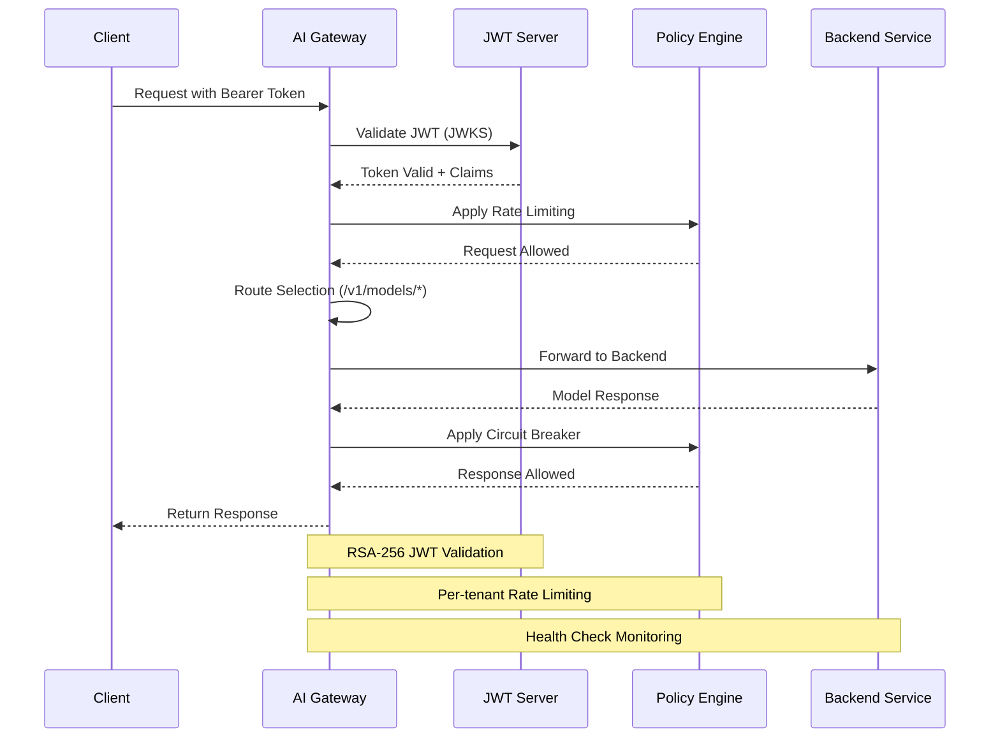
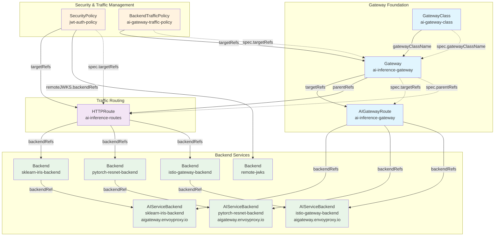
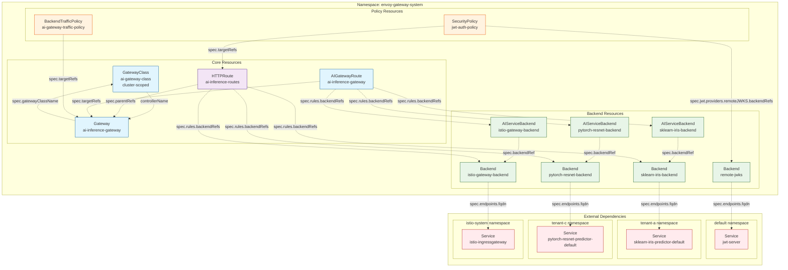
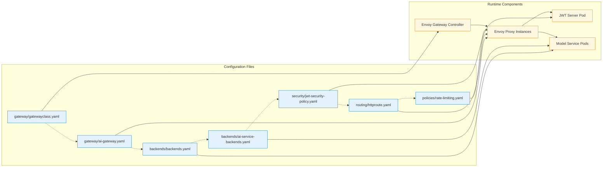

# Envoy Gateway Configuration

This directory contains the complete Envoy Gateway configuration for the AI inference platform, organized by functionality for easy navigation and maintenance.

## Directory Structure

```
envoy-gateway/
├── README.md                 # This file
├── gateway/                  # Core gateway configuration
│   ├── gatewayclass.yaml    # Gateway class definitions
│   └── ai-gateway.yaml      # Main AI inference gateway
├── security/                 # Security and authentication
│   ├── jwt-security-policy.yaml # JWT authentication and authorization
│   ├── reference-grants.yaml    # Cross-namespace access grants
│   └── backend-security-policy.yaml # Backend API key management
├── backends/                 # Backend service definitions
│   ├── backends.yaml        # Standard backend definitions
│   └── ai-service-backends.yaml # AI service backend mappings
├── routing/                  # Traffic routing configuration
│   └── httproute.yaml       # HTTP route definitions
├── policies/                 # Traffic policies
│   └── rate-limiting.yaml   # AI Gateway usage-based rate limiting and traffic policies
└── observability/            # Monitoring and telemetry
    └── telemetry-config.yaml # Performance tracking configuration
```

## Architecture Overview

```mermaid
graph TB
    %% External Traffic
    Client[Client/User] --> Gateway[AI Inference Gateway<br/>:80, :443]
    
    %% Gateway Layer
    Gateway --> JWT{JWT<br/>Authentication}
    JWT -->|Valid Token| Routes[HTTP Routes]
    JWT -->|Invalid Token| Deny[❌ Denied]
    
    %% Routing Layer
    Routes --> ModelA[/v1/models/sklearn-iris]
    Routes --> ModelB[/v1/models/pytorch-resnet]
    Routes --> Fallback[/* Fallback]
    
    %% Backend Services
    ModelA --> BackendA[sklearn-iris-backend<br/>tenant-a:80]
    ModelB --> BackendB[pytorch-resnet-backend<br/>tenant-c:80]
    Fallback --> BackendC[istio-gateway-backend<br/>istio-system:80]
    
    %% Security & Policy Layer
    subgraph Security [Security Layer]
        JWT
        Auth[Authorization Rules<br/>tenant-a, tenant-b, tenant-c]
        JWKS[JWT Server<br/>JWKS Endpoint]
    end
    
    subgraph Policies [Policy Layer]
        RateLimit[Rate Limiting<br/>100 req/min per tenant<br/>1000 req/min global]
        CircuitBreaker[Circuit Breaker<br/>Max: 100 conn, 50 pending]
        HealthCheck[Health Checks<br/>Active monitoring]
    end
    
    %% Backend Infrastructure
    subgraph Backends [Backend Services]
        BackendA
        BackendB
        BackendC
    end
    
    %% Apply policies to all traffic
    Gateway -.-> Policies
    Routes -.-> Policies
    
    %% JWT validation
    JWT -.-> JWKS
    Auth -.-> JWT
    
    %% Styling
    classDef gateway fill:#e1f5fe
    classDef security fill:#fff3e0
    classDef policy fill:#f3e5f5
    classDef backend fill:#e8f5e8
    classDef client fill:#ffebee
    
    class Gateway gateway
    class JWT,Auth,JWKS security
    class RateLimit,CircuitBreaker,HealthCheck policy
    class BackendA,BackendB,BackendC backend
    class Client client
```

## Data Flow Diagram



## Configuration Object Relationships



## Kubernetes Resource Dependencies



## Component Interaction Matrix



## Configuration Overview

### Gateway Configuration (`gateway/`)

#### `gatewayclass.yaml`
- **Purpose**: Defines gateway classes for the Envoy Gateway controller
- **Resources**:
  - `ai-gateway-class`: Specialized gateway class for AI workloads
  - `eg`: Standard Envoy Gateway class
- **Key Features**: AI-specific capabilities and standard gateway functionality

#### `ai-gateway.yaml`
- **Purpose**: Main gateway configuration for AI inference
- **Resources**:
  - `ai-inference-gateway`: Primary gateway with HTTP/HTTPS listeners
  - `ai-inference-gateway` (AIGatewayRoute): AI-specific routing rules
- **Key Features**:
  - HTTP (port 80) and HTTPS (port 443) listeners
  - TLS termination with `ai-gateway-tls` certificate
  - Tenant-based routing with header matching
  - OpenAI schema compatibility
  - **AI Gateway Token Tracking**:
    - Input token tracking (`llm_input_token`)
    - Output token tracking (`llm_output_token`)
    - Total token tracking (`llm_total_token`)
    - Automatic token extraction from OpenAI responses

### Security Configuration (`security/`)

#### `jwt-security-policy.yaml`
- **Purpose**: JWT authentication and authorization policies
- **Resources**:
  - `jwt-auth-policy`: SecurityPolicy for JWT validation
  - `remote-jwks`: Backend for JWKS endpoint
- **Key Features**:
  - RSA-based JWT validation with remote JWKS
  - Tenant-based authorization rules
  - Retry mechanism for JWKS fetching
  - Claims validation for tenant access

#### `reference-grants.yaml`
- **Purpose**: Cross-namespace access permissions (KServe best practice)
- **Resources**: ReferenceGrant objects for secure cross-namespace communication
- **Key Features**:
  - Envoy Gateway → Tenant namespace access
  - Envoy Gateway → Default namespace (JWT server)
  - Envoy Gateway → Istio system (fallback)
  - Granular permissions for HTTPRoute, Backend, and AIServiceBackend

#### `backend-security-policy.yaml`
- **Purpose**: Backend API key management and external authentication
- **Resources**:
  - `model-backend-security`: BackendSecurityPolicy with basic auth
  - `api-key-security`: External auth service integration
  - `ext-auth-service`: Custom authentication service
- **Key Features**:
  - Multi-layer authentication (JWT + API keys)
  - Custom external auth service with tenant validation
  - Secure credential management via Kubernetes secrets

**Security Model**:
- **Authentication**: Multi-layer (JWT + API keys + external auth)
- **Authorization**: Tenant claim validation (`tenant-a`, `tenant-b`, `tenant-c`)
- **Cross-namespace**: Secured with ReferenceGrants
- **Default**: Deny all requests without proper authentication

### Backend Configuration (`backends/`)

#### `backends.yaml`
- **Purpose**: Standard backend endpoint definitions
- **Resources**:
  - `sklearn-iris-backend`: scikit-learn model backend
  - `pytorch-resnet-backend`: PyTorch model backend
  - `istio-gateway-backend`: Fallback to Istio gateway
  - `remote-jwks`: JWT server JWKS endpoint
- **Key Features**: FQDN-based service discovery

#### `ai-service-backends.yaml`
- **Purpose**: AI Gateway service backend configurations
- **Resources**: 
  - **AI Gateway Backends** (`aigateway.envoyproxy.io/v1alpha1`):
    - `sklearn-iris-backend`: References standard Backend with OpenAI schema
    - `pytorch-resnet-backend`: References standard Backend with OpenAI schema
    - `istio-gateway-backend`: References standard Backend with OpenAI schema
- **Key Features**:
  - OpenAI API compatibility layer
  - Backend reference architecture
  - Standardized AI service interface
  - Schema validation for AI requests

### Routing Configuration (`routing/`)

#### `httproute.yaml`
- **Purpose**: HTTP traffic routing rules
- **Resources**: `ai-inference-routes` HTTPRoute
- **Key Features**:
  - **JWT-Protected Routes**: 
    - `/v1/models/sklearn-iris` → `tenant-a` namespace
    - `/v1/models/pytorch-resnet` → `tenant-c` namespace
  - **Request Modification**: Automatic tenant and gateway header injection
  - **Fallback Routing**: Unmatched requests forwarded to Istio gateway
  - **Authorization**: Bearer token requirement for model routes

### Policy Configuration (`policies/`)

#### `rate-limiting.yaml`
- **Purpose**: AI Gateway usage-based rate limiting and traffic management
- **Resources**: `ai-gateway-traffic-policy` BackendTrafficPolicy
- **Key Features**:
  - **Token-based Rate Limiting** (follows AI Gateway official documentation):
    - sklearn-iris model: 10000 tokens/hour (request cost = 0, response cost = token count)
    - pytorch-resnet model: 10000 tokens/hour (request cost = 0, response cost = token count)
    - Token tracking via AI Gateway metadata (`llm_total_token`)
    - Header-based routing with `x-tenant` and `x-ai-eg-model`
  - **Standard Rate Limiting**:
    - Per-tenant general limits: 100 requests/minute
    - JWT-authenticated users: 500 requests/minute
    - Global limit: 10000 requests/hour
  - **Circuit Breaker**:
    - Max connections: 100
    - Max pending requests: 50
    - Max parallel requests: 200
  - **Retry Policy**: 3 retries on 5xx errors
  - **Optimized Timeouts**:
    - TCP connect: 10s
    - HTTP request: 60s (AI workload optimized)
    - Connection idle: 300s (5 minutes)
  - **Health Checks**: Active health monitoring

### Observability Configuration (`observability/`)

#### `telemetry-config.yaml` (Optional)
- **Purpose**: Basic telemetry and access logging for AI Gateway
- **Resources**: 
  - `ai-gateway-telemetry`: EnvoyProxy with simplified telemetry configuration
  - `ai-gateway-dashboard`: Grafana dashboard configuration
- **Key Features**:
  - **Metrics Collection**:
    - Prometheus metrics export
    - Basic request/response metrics
  - **Access Logging**:
    - Structured logging with tenant/model context
    - Token consumption logging from AI Gateway metadata
    - JWT subject tracking
    - File-based log output
  - **Custom Dashboards**:
    - Grafana dashboard for AI Gateway performance
    - Token usage visualization
    - Error rate monitoring by tenant
    - Request latency percentiles
- **Note**: Advanced features like OpenTelemetry integration and custom metrics may require additional configuration or newer Envoy Gateway versions

## Deployment Order

Deploy configurations in the following order to ensure proper dependencies:

1. **Gateway Foundation**:
   ```bash
   kubectl apply -f gateway/gatewayclass.yaml
   kubectl apply -f gateway/ai-gateway.yaml
   ```

2. **Backend Services**:
   ```bash
   kubectl apply -f backends/backends.yaml
   kubectl apply -f backends/ai-service-backends.yaml
   ```

3. **Security Policies** (KServe optimized):
   ```bash
   kubectl apply -f security/reference-grants.yaml
   kubectl apply -f security/jwt-security-policy.yaml
   kubectl apply -f security/backend-security-policy.yaml
   ```

4. **Routing Rules**:
   ```bash
   kubectl apply -f routing/httproute.yaml
   ```

5. **Traffic Policies**:
   ```bash
   kubectl apply -f policies/rate-limiting.yaml
   ```

6. **Observability** (Optional):
   ```bash
   # kubectl apply -f observability/telemetry-config.yaml
   ```

## Configuration Validation

### Prerequisites
- Envoy Gateway installed and running
- JWT server deployed and accessible
- Target AI model services running in respective namespaces

### Validation Commands

```bash
# Verify gateway status
kubectl get gateway ai-inference-gateway -n envoy-gateway-system

# Check security policy
kubectl get securitypolicy jwt-auth-policy -n envoy-gateway-system

# Validate backends
kubectl get backend -n envoy-gateway-system

# Test JWT authentication
curl -H "Authorization: Bearer <jwt-token>" \
     https://your-gateway/v1/models/sklearn-iris:predict
```

## Troubleshooting

### Common Issues

1. **JWT Authentication Failures**:
   - Check JWT server accessibility: `kubectl get backend remote-jwks -n envoy-gateway-system`
   - Verify JWKS endpoint: `curl http://jwt-server.default.svc.cluster.local:8080/.well-known/jwks.json`

2. **Rate Limiting Issues**:
   - Check traffic policy status: `kubectl describe backendtrafficpolicy ai-gateway-traffic-policy -n envoy-gateway-system`
   - Monitor rate limit metrics in Envoy admin interface

3. **Backend Connection Issues**:
   - Verify backend health: `kubectl get backend <backend-name> -n envoy-gateway-system -o yaml`
   - Check target service availability: `kubectl get svc -n <target-namespace>`

### Debug Commands

```bash
# Check Envoy proxy logs
kubectl logs -l app=envoy-gateway -n envoy-gateway-system

# View gateway configuration
kubectl get gateway ai-inference-gateway -n envoy-gateway-system -o yaml

# Check route status
kubectl get httproute ai-inference-routes -n envoy-gateway-system -o yaml
```

## Security Considerations

- **JWT Tokens**: Use strong RSA keys and implement proper token rotation
- **TLS**: Ensure valid certificates for HTTPS listeners
- **Rate Limiting**: Adjust limits based on expected traffic patterns
- **Backend Security**: Verify backend service security configurations
- **Network Policies**: Implement Kubernetes network policies for additional security

## Monitoring and Observability

- **Metrics**: Envoy Gateway exposes Prometheus metrics
- **Tracing**: Configure OpenTelemetry for distributed tracing
- **Logging**: Enable access logs for audit and debugging
- **Health Checks**: Monitor active health check status

## Maintenance

- **Regular Updates**: Keep Envoy Gateway and configurations updated
- **Certificate Rotation**: Implement automated TLS certificate renewal
- **Configuration Validation**: Use CI/CD pipelines for configuration validation
- **Backup**: Maintain versioned backups of configurations