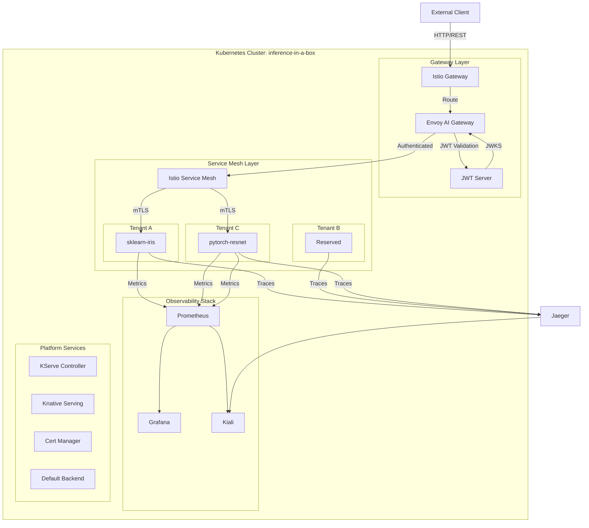
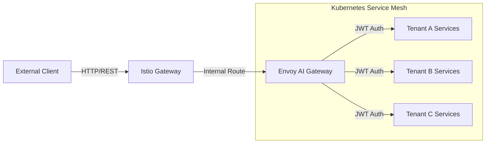
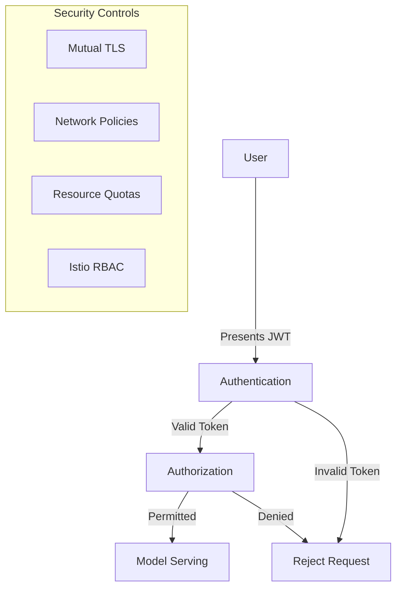

# Inference-in-a-Box: Architecture Design

> **📋 Navigation:** [🏠 Main README](../README.md) • [🎯 Goals & Vision](../GOALS.md) • [🚀 Getting Started](getting-started.md) • [📖 Usage Guide](usage.md) • [🤖 AI Assistant](../CLAUDE.md)

This document outlines the architecture and design principles of the Inference-in-a-Box platform.

> **🎯 Context:** To understand why these architectural choices were made, see [GOALS.md](../GOALS.md)
> **🚀 Implementation:** For hands-on deployment of this architecture, see [Getting Started Guide](getting-started.md)

## Architecture Overview

Inference-in-a-Box is designed as a single unified Kubernetes cluster solution that provides enterprise-grade AI/ML inference capabilities. The platform integrates multiple cloud-native technologies to deliver a comprehensive, secure, and observable AI/ML inference environment.

## Components

### Core Platform Components

#### Kubernetes and Kind
- **Version**: Latest Kind with Kubernetes
- **Role**: Provides the container orchestration foundation
- **Configuration**: Single cluster named "inference-in-a-box" with control plane and worker nodes

#### Istio Service Mesh
- **Version**: 1.26.2
- **Role**: Service mesh providing traffic management, security, and observability
- **Key Features**: Ingress gateway, telemetry collection, authorization policies

#### KServe
- **Version**: 0.15.0
- **Role**: Serverless model serving for various ML frameworks
- **Key Features**: Scale-to-zero, multi-framework support, canary deployments
- **Deployment Mode**: Serverless (default)

#### Knative Serving
- **Version**: 1.14.1
- **Role**: Serverless infrastructure for KServe
- **Key Features**: Autoscaling, revision management

#### Cert Manager
- **Version**: 1.18.1
- **Role**: Certificate management
- **Key Features**: Automated certificate issuance and renewal

### Observability Stack

#### Prometheus
- **Version**: 2.50.1
- **Role**: Metrics collection and alerting
- **Key Features**: Time-series database, PromQL, alerting rules

#### Grafana
- **Version**: 10.4.0
- **Role**: Metrics visualization and dashboards
- **Key Features**: Custom dashboards for model performance monitoring

#### Jaeger
- **Version**: 1.55.0
- **Role**: Distributed tracing
- **Key Features**: End-to-end request tracing, latency analysis

#### Kiali
- **Version**: 2.11.0
- **Role**: Service mesh visualization and management
- **Key Features**: Service graph, traffic visualization, configuration validation

### Gateway & Security Components

#### Envoy Gateway
- **Version**: 1.4.2
- **Role**: API Gateway platform built on Envoy proxy
- **Key Features**: Traffic management, security, observability
- **Architecture**: Kubernetes-native gateway API implementation

#### Envoy AI Gateway
- **Version**: 0.2.1
- **Role**: Purpose-built API gateway for AI/ML model endpoints
- **Key Features**: JWT validation, request routing, rate limiting, model management
- **Architecture**: Extension of Envoy Gateway with AI/ML-specific features via AIApplication CRD

## Design Principles

### Single Cluster Architecture

The platform uses a single unified Kubernetes cluster named "inference-in-a-box" to simplify deployment and management while still maintaining all functional capabilities. This design:

- Reduces operational complexity
- Streamlines deployment and upgrades
- Simplifies network communications
- Provides a consistent security model

### Multi-tenant Security

Strong tenant isolation is achieved through:

1. **Namespace Isolation**: Each tenant has a dedicated namespace
2. **Network Policies**: Restricting cross-namespace communication
3. **Istio Authorization Policies**: Fine-grained access control
4. **JWT Authentication**: Token-based tenant verification
5. **Resource Quotas**: Preventing resource monopolization

### Zero-Trust Security Model

The platform implements a zero-trust security architecture:

1. **Mutual TLS**: All service-to-service communication is encrypted
2. **Authentication**: JWT tokens required for all API requests
3. **Authorization**: Fine-grained policies at the service level
4. **Network Policies**: Default-deny with explicit allowlists

### Serverless Model Serving

KServe provides serverless ML model serving with full scale-to-zero capability:

1. **Scale-to-Zero**: Models scale to zero pods when not in use, consuming no resources
2. **Auto-scaling**: Dynamic scaling based on request load and CPU/memory utilization
3. **Cold-start Optimization**: Fast model loading with configurable grace periods
4. **Multi-framework Support**: TensorFlow, PyTorch, scikit-learn, ONNX, etc.
5. **Cost Efficiency**: Pay only for actual usage, ideal for diverse workloads
6. **Model Lifecycle**: Versioning, canary deployments, A/B testing
7. **Knative Integration**: Leverages Knative's serverless infrastructure

### Comprehensive Observability

The platform provides full observability:

1. **Metrics**: Prometheus for system and model metrics
2. **Logs**: Centralized logging
3. **Traces**: Jaeger for distributed tracing
4. **Visualization**: Grafana dashboards and Kiali service mesh graph

## Network Architecture

Network flow:
1. External client sends request to Istio Gateway
2. Istio Gateway routes to Envoy AI Gateway
3. Envoy Gateway validates JWT tokens and routes to appropriate tenant service
4. Model service processes request and returns response through the same path

## Security Architecture

Security layers:
1. JWT Authentication
2. Namespace-level isolation
3. Istio authorization policies
4. Network policies
5. Resource quotas
6. Mutual TLS encryption

## Versioning Strategy

All components of the platform are versioned explicitly for easy upgrades and maintenance. Version variables are defined at the top of the bootstrap.sh script:

- Istio: 1.26.2
- KServe: 0.15.0
- Cert-Manager: 1.18.1
- Prometheus: 2.50.1
- Grafana: 10.4.0
- Jaeger: 1.55.0
- Kiali: 2.11.0
- Knative: 1.14.1

This approach allows for:
- Controlled upgrades
- Consistent deployments
- Clear documentation of component versions
- Testing compatibility between versions
